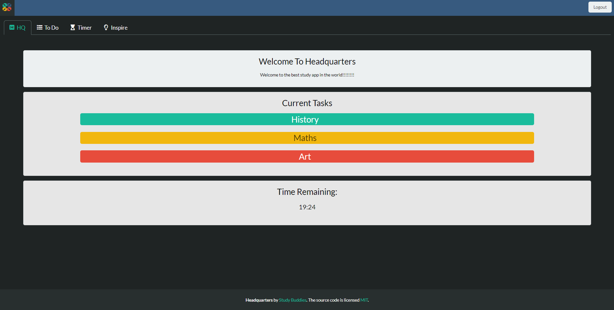

# Headquarters

[](https://opensource.org/licenses/MIT)

## Description

Like a study buddy in your pocket, Headquarters, an all encompassing productivity app will help maintain good habits and discipline when students need it most - injecting inspiration into the pursuit of achieving goals!

Headquarters provides students with organisational tools for prioritising tasks such as;

- Ability to signup for a new account and login securely to existing accounts
- A robust todo list tracker with tasks that appear everytime a user logs onto Headquarters
- A convenient timer utilising the pomodoro technique that follows you throughout the app
- A motivation hub offering insightful quotes & videos to keep you feeling inspired.

Link to the Heroku application for "Headquarters": [view app](https://safe-beach-27101.herokuapp.com).





## Table of Contents

- [Installation](#installation)
- [Usage](#usage)
- [License](#license)
- [Contributing](#contributing)
- [Credits](#credits)
- [Tests](#tests)
- [Questions](#questions)
- [Documentation](#documentation)

## Installation

Clone these files from the GitHub repository via your preferred means. Then make sure to install necessary dependencies by running the following commands:

```
npm init
```

```
npm install
```

## Usage

Once the files have been pull down to your preferred repository, run this application by inputting 'npm run watch' into your bash terminal. The server will start. You can then view the application in the default browser.

Alternatively the link to the Heroku application for "Headquarters" can be viewed here: [view app](https://safe-beach-27101.herokuapp.com).

## License

This project is licensed by the [MIT](https://opensource.org/licenses/MIT) license

## Contributing

If this project is of interest to you, please contact Study Buddies with a detailed description of how you would like to contribute prior to any pull requests.

## Credits

- Frontend: [Bulma](https://bulma.io/documentation/), [p5.js](https://p5js.org/) & [Handlebars](https://handlebarsjs.com/)
- Backend: [Express.js](http://expressjs.com/), [brcryt](https://www.npmjs.com/package/bcrypt), [Moment](https://momentjs.com/docs/) & [Node.js](https://nodejs.dev/)
- Database: [MySQL](https://www.npmjs.com/package/mysql2) & [Sequelize](https://sequelize.org/)
- Deployment: [Heroku](https://devcenter.heroku.com/)

## Tests

There are currently no tests for this application. If you experience any issues, please contact our team.

## Questions

If you have any questions or require further clarification then please contact our team via any of the following links:

- https://github.com/Shelbyrp/
- https://github.com/Robert-Rousset/
- https://github.com/DandyCodes

## Documentation

- View Headquarters presentation - https://docs.google.com/presentation/d/1f7fHlRamzrZFWE3o73merYfhA81zmpCfwW_G-jCXO18/edit?usp=sharing

- View Headquarters user story map and wireframes - https://miro.com/app/board/o9J_l_qWJ2w=.

- Press Release - https://docs.google.com/document/d/1FkDl8grFOlOuYnEGnwR7GoF-DbeNy_M_ilO3Eo8-Mr0/edit?usp=sharing

- Working Backwards Workshop - https://docs.google.com/document/d/1eTpqlSDzilaae7dMSO05irCIotTwGDpUGvq6GbNEex0/edit?usp=sharing
